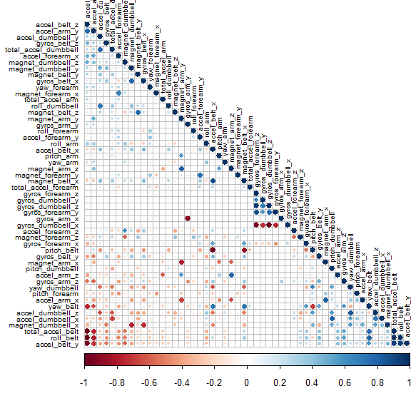

## Executive Summary  
In this project we use data from a weightlifting exercise study. In the study, 6 young male participants aged between 20 and 28 years performed one set of 10 repetitions of the Unilateral Dumbbell Biceps Curl by 5 different techniques under supervision of an experienced weightlifter. Class A is the proper technique according to the specification. Class B to Class E are different forms of common mistakes made when performing the exercise. Measurements were taking during exercise using accelerometers from 3 on-body sensors (on an arm band, belt, and glove) and 1 sensor on the dumbbell. In this project we use the data produced by these sensors to distinguish the quality of execution of the specific exercise by the user. We use data from the sensors to build a prediction algorithm that can classify the exercise technique into one of the 5 classes A to E.  

Reference: 
*Velloso, E.; Bulling, A.; Gellersen, H.; Ugulino, W.; Fuks, H. Qualitative Activity Recognition of Weight Lifting Exercises. Proceedings of 4th International Conference in Cooperation with SIGCHI (Augmented Human '13) . Stuttgart, Germany: ACM SIGCHI, 2013. Read more: http://groupware.les.inf.puc-rio.br/har#ixzz6O3grXRCI*

## Setting up the Data  
First we download the training dataframe, which has a column on the class of exercise. We will use this dataframe to build our models. We also download the test dataframe, which contains 20 observations without a classification column that we will use in the quiz. We remove columns in the data that are empty or contain explicit NAs and also remove the columns that are unrelated to the body sensor data. We then split the training dataframe into a training set to build our models and a testing set to measure the error of the models. We set the seed to create reproducible data sets.  

```r
#Download data
url_tr <- "https://d396qusza40orc.cloudfront.net/predmachlearn/pml-training.csv"
url_ts <- "https://d396qusza40orc.cloudfront.net/predmachlearn/pml-testing.csv"

if(!file.exists("wl_train.csv")) download.file(url_tr, "wl_train.csv")
if(!file.exists("wl_test.csv")) download.file(url_ts, "wl_test.csv")

#Load data - both empty cells and explict NAs are recognised as NA 
wl_train <- read.csv("wl_train.csv", na.strings = c(NA, ""))
wl_test <- read.csv("wl_test.csv", na.strings = c(NA, ""))

# Remove variables with NAs
na_cols <- colSums(is.na(wl_train))
na_index <- which(na_cols > 0)

train_df <- wl_train[,-na_index]
test_df <- wl_test[, -na_index]

# Remove variables that do not pertain to exercise (e.g., names, dates)
train_df <- train_df[,c(-1, -2, -3, -4, -5, -6, -7)]
test_df <- test_df[,c(-1, -2, -3, -4, -5, -6, -7)]

# Create Training and Testing Set from train_df
set.seed(20200531)
inTrain <- createDataPartition(y = train_df$classe, p =0.7, list = FALSE)
training <- train_df[inTrain,]
testing <- train_df[-inTrain,]

dim(training); dim(testing)
```

```
## [1] 13737    53
```

```
## [1] 5885   53
```

The first processing step we take is to identify variables that have zero covariance as these are not useful for prediction.  

```r
nsv <- nearZeroVar(training, saveMetrics = TRUE)  
sum(nsv$nzv == TRUE)
```

```
## [1] 0
```
There are no such variables.    
## Principal Components
Another question we have is whether any of the predictors are highly correlated with each other. In this case it might be useful to use weighted combinations of predictors rather than every predictor.  

```r
corr_matrix <- cor(training[,-53])
corrplot::corrplot(corr_matrix, order = "FPC", method = "circle", type = "lower", tl.cex = 0.6, tl.col = "black")
```

<!-- -->
  It doesn't seem that too many predictors are highly correlated with each other, so we will not use PCA. In fact we did fit PCA models out of interest (not shown here) and they achieved around 93% test set accuracy, which is less than the final accuracy of the model used in this report that is build using all the predictors.  
## Training the Models and Testing Predictions  
We train 4 different models with 3-fold cross-validation. They are: (1) K-Nearest Neighbours, (2) Random Forest, (3) Generalised Boosted Model, and (4) Bagging. Each model is used to make predictions on the test set, from which the test accuracy is calculated.   

```r
control <-  trainControl(method = "cv", number = 3, allowParallel = TRUE)

#KNN
knnMod <- train(classe ~ ., data = training, method = "knn", tuneGrid = data.frame(k = seq(3,21,2)), 
                 preProcess = c("center", "scale"),  trControl = control)

#RF
rfMod <- train(classe ~ ., data = training, method = "rf", preProcess = c("center", "scale"),
                trControl = control, importance = TRUE)

#GBM
gbmMod <- train(classe ~ ., data = training, method = "gbm", verbose = FALSE, preProcess = c("center", "scale"),
                 trControl = control)

#Bag
bagMod <- train(classe ~ ., data = training, B = 10, bagControl = bagControl(fit = ctreeBag$fit,
                                                                          predict = ctreeBag$pred,
                                                                          aggregate = ctreeBag$aggregate),
                 preProcess = c("center", "scale"),  trControl = control)

p_knn <-  predict(knnMod, testing)
p_rf <- predict(rfMod, testing)
p_gbm <- predict(gbmMod, testing)
p_bag <- predict(bagMod, testing)

p_all <- data.frame(p_knn, p_rf, p_gbm, p_bag)

acc <- sapply(p_all, function(p) confusionMatrix(factor(testing$classe), p)$overall["Accuracy"])
acc
```

```
## p_knn.Accuracy  p_rf.Accuracy p_gbm.Accuracy p_bag.Accuracy 
##      0.9760408      0.9937128      0.9661852      0.9932031
```
All 4 models perform well, with Random Forest and Bagging having the highest accuracy.  
## Ensemble  
Out of interest we create an ensemble model that makes a prediction by majority vote from the top 3 models: KNN, random forest and bagging.  

```r
p_ens1 <- apply(p_all[-3],1,table)
ens1_tab <- sapply(p_ens1, which.max)
ens1_pred <- factor(names(ens1_tab))
confusionMatrix(factor(testing$classe), ens1_pred)$overall["Accuracy"]
```

```
##  Accuracy 
## 0.9938828
```
The accuracy of the ensemble model does not improve on random forest and bagging alone.  
## Making Predictions on Unknown Data  
We use the random forest model to predict the classes of the unknown observations in the test dataframe.  

```r
predict(rfMod, test_df[,-53])
```

```
##  [1] B A B A A E D B A A B C B A E E A B B B
## Levels: A B C D E
```
Overall, we have generated a highly accurate model that can predict the technqiue used when executing a unilateral dumbbell biceps curl with data from wearable sensors. This has implications for the quantified self movement as it means that exercise patterns cannot just be quantified (i.e. how much) but also qualified (i.e. how well).
